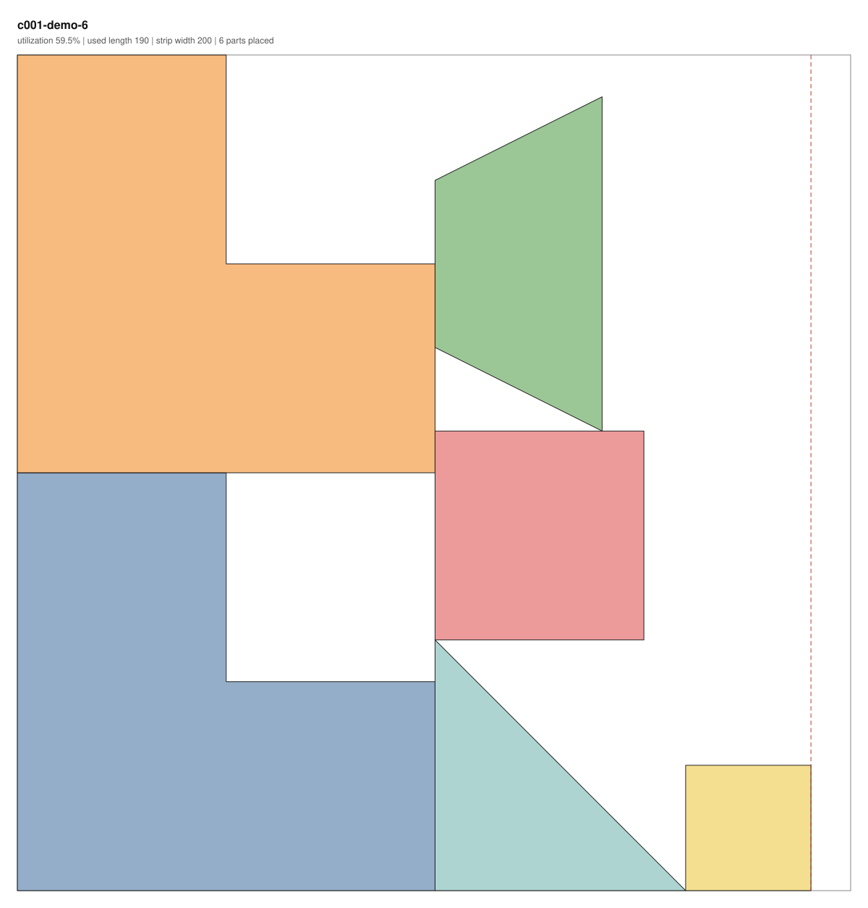
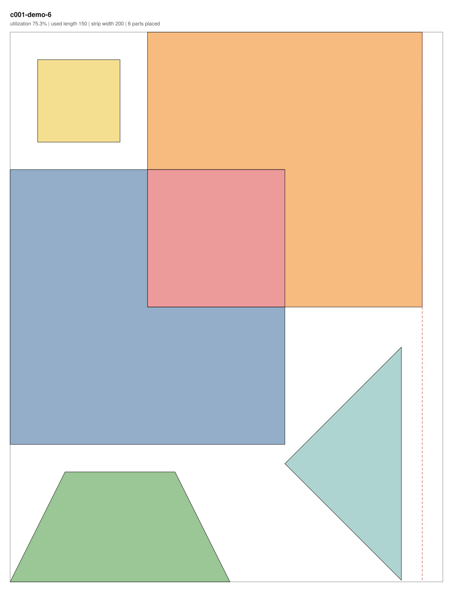

# Étude no. 1 — Irregular Shape Nesting (c001)

**Status: `open`** — mirrors `status:` in [`challenge.yaml`](challenge.yaml). The annotated tag
`c001-start` is frozen on `main` and every attempt branch forks from it:

```sh
git fetch --tags
git switch -c attempt/c001/<you>/1 c001-start
```

The workflow around the étude — branch names, `session/`, annotating afterwards — is in
[CONTRIBUTING.md](../../CONTRIBUTING.md). This file is the position itself.

---

## The challenge

You are given a strip of material of fixed width and unbounded length, and a set of irregular
polygonal parts. Write a solver that places **every** part on the strip — translated and rotated,
no overlaps, nothing outside the strip — while **minimizing the length of material used**. Quality
is measured as **utilization**: total part area ÷ (strip width × used length). A valid layout is
instantly visible as an SVG: a better layout has visibly less whitespace and a higher utilization
number. Naive bounding-box packing gets you to somewhere around 45–50% in the first hour — the
baseline shipped here measures 44.6–51.0% on the dev set — and the interesting work is climbing
from there toward 80%+ through real computational geometry and optimization, a domain most
participants will not know. That is the point of the étude.

---

## Rules

1. **Objective:** maximize utilization, reported to one decimal place. Utilization is the only
   measure this étude produces; nothing here compares one participant against another.
2. **Tiers, not standings.** Tier 1: convex parts. Tier 2: concave (simple) parts. Tier 3: parts
   may contain holes, and placing parts inside other parts' holes is legal and profitable. Tiers
   are personal rungs — climb as far as you get to in your four hours.
3. **Runtime:** ≤ 60 seconds wall-clock per instance, single process, on your own machine, honour
   system. Your solver must accept `--time-budget SECONDS` and respect it.
4. **Allowed:** any language; any general-purpose library, including geometry libraries (Shapely,
   Clipper, CGAL bindings, …) and generic optimization libraries (SciPy, OR-Tools CP-SAT, SAT/ILP
   solvers). Web research is allowed and encouraged.
5. **Banned:** purpose-built irregular-nesting software or ports of it (SVGnest, Deepnest,
   libnest2d / nest2D, commercial nesting tools). The line: primitives and generic solvers yes,
   ready-made nesting pipelines no.
6. **No flips or mirroring** — the material has a face side. Rotation is free (any real angle) in
   all three tiers.
7. **Contamination control:** instances come from a seeded generator. Dev instances are committed;
   hidden instances use secret seeds published only after the round closes.
8. Everything runs offline on a laptop. The organizer tooling is Python 3.11+, stdlib + PyYAML +
   Shapely, installed by `uv sync --all-groups` (Shapely lives in the `c001` dependency group).

### Two amendments to the original brief

- **Size bands scaled ×2.8.** The brief's bands, at 40 parts per instance, cannot add up to the
  required total area, so all three were scaled: large 8–17·10⁴ (25% of parts), medium 2–8·10⁴
  (50%), small 0.3–2·10⁴ (25%). Total net part area per instance is drawn from
  [2.0·10⁶, 3.0·10⁶], so a perfect layout would use length 2000–3000 at `strip_width = 1000`.
- **Placeability is capped by point-set diameter ≤ 850** (= 0.85 × strip width), rather than by a
  bounding circle. The point-set diameter is exact and cheap to compute deterministically, and it
  bounds every rotated extent — so every part provably fits the strip at some angle.

---

## Geometry conventions

- 2D Cartesian, floating point. Units are abstract.
- The strip occupies `0 ≤ y ≤ W` and `x ≥ 0`, extending unboundedly in +x. `W` is `strip_width`
  (1000.0 throughout the dev set).
- **Used length** `L` = the maximum x-coordinate over all vertices of all placed parts.
  **Utilization** = Σ(part areas) / (W × L), with part area net of holes.
- A polygon is a list of `[x, y]` vertices, implicitly closed (the first vertex is **not** repeated
  at the end) and simple. Exterior rings are counter-clockwise, hole rings clockwise.
- Parts are defined in local coordinates with their axis-aligned bounding-box minimum at the local
  origin `(0, 0)`.
- **Placement transform:** rotate the part counter-clockwise by `rotation_deg` about the local
  origin `(0, 0)`, **then** translate by `[tx, ty]`. Exactly that order. (In Shapely, build it with
  `affine_transform` — `rotate()` defaults to rotating about the centroid, which is not this.)

## File formats

**Instance** — `instances/dev/<instance_id>.json`, read-only input:

```json
{
  "instance_id": "c001-t1-dev-01",
  "challenge": "c001",
  "tier": 1,
  "seed": 1001,
  "strip_width": 1000.0,
  "rotations_allowed": "free",
  "parts": [
    {"id": "p001", "exterior": [[0.0, 0.0], [120.4, 3.2], [95.1, 88.7]], "holes": []}
  ]
}
```

`rotations_allowed` is `"free"` for this étude; the field exists for future rounds, and when it is
a list of degrees the validator enforces it. Every part id is unique — duplicate shapes appear as
separate entries, there is no quantity field. `holes` is always present, and empty outside tier 3.
Committed instances also carry an informational `generator` block (`version`, `parts`); ignore it.

**Solution** — `solutions/<instance_id>.json` on your attempt branch, what you write:

```json
{
  "instance_id": "c001-t1-dev-01",
  "solver": {"name": "alice-nester", "version": "0.3", "seed": 7},
  "placements": [
    {"part_id": "p001", "translation": [412.0, 96.5], "rotation_deg": 37.5}
  ]
}
```

Exactly one placement per part id in the instance — missing, duplicate or unknown ids are
validation errors. The `solver` block is informational and optional.

## Tolerance

`TOL_AREA = 0.01` square units, applied **inclusively and per check**, not as a budget you may
spend across the layout:

- `OUTSIDE_STRIP` — **per part**: the area lying outside `[0, ∞) × [0, W]` must be ≤ 0.01.
- `OVERLAP` — **per pair**: the area of the intersection of two placed parts must be ≤ 0.01.

Exactly 0.01 passes; the validator rejects only areas strictly greater. With `W = 1000` and part
areas of 10³–10⁵ this permits hairline boundary-contact effects and nothing else. Two parts sharing
an edge exactly are valid, and a part placed fully inside another part's hole is valid — holes are
real holes, not decoration.

Violations are reported with stable codes: `SCHEMA`, `INSTANCE_MISMATCH`, `MISSING_PLACEMENT`,
`DUPLICATE_PLACEMENT`, `UNKNOWN_PART`, `ROTATION_NOT_ALLOWED`, `INVALID_GEOMETRY`, `OUTSIDE_STRIP`,
`OVERLAP`.

> The full brief, including the reasoning behind these choices, is
> [`docs/handoffs/HANDOFF-CHALLENGE.md`](../../docs/handoffs/HANDOFF-CHALLENGE.md). Where it and
> this file differ, this file and the tools are what actually gets checked (see the two amendments
> above).

---

## Running the tools

All commands are from the repository root; every tool also runs from any other directory, since
each resolves its own imports. Run `uv sync --all-groups` once, first.

**Validate a layout** — exit 0 valid, 1 invalid, 2 unreadable input:

```sh
uv run python challenges/c001/tools/validate.py \
    challenges/c001/instances/dev/c001-t1-dev-01.json \
    solutions/c001-t1-dev-01.json --json --svg layout.svg
```

It prints one human line, `VALID  used_length=4800.621  utilization=44.6%`. `--json` adds a
machine-readable object as the last stdout line — this is what CI echoes:

```json
{"valid": true, "instance_id": "c001-t1-dev-01",
 "summary": "VALID  used_length=4800.621  utilization=44.6%", "errors": [],
 "measures": {"used_length": 4800.621, "utilization_pct": 44.6}}
```

`--svg FILE` renders the layout while validating, and `--labels` puts part ids on that SVG.

**Render** — omit the solution for a parts-catalog view of the instance:

```sh
uv run python challenges/c001/tools/render.py <instance.json> [<solution.json>] --out FILE.svg [--labels]
```

**Baseline solver** — the reference floor, and a working example of the solver CLI:

```sh
uv run python challenges/c001/tools/baseline.py <instance.json> --out FILE.json \
    [--time-budget 60] [--seed 0] [--quiet]
```

**Gallery** — one self-contained HTML page, grouped by instance, alphabetical inside a group.
Accepts files, directories or globs:

```sh
uv run python challenges/c001/tools/gallery.py build/c001-demo/dev --out gallery.html \
    [--instances-dir challenges/c001/instances/dev]
```

**Generator** — you rarely need it during a session; it is how the hidden instances get reproduced
from published seeds. `--id` is required and never influences the geometry:

```sh
uv run python challenges/c001/tools/generate.py --tier 1 --seed 4242 --id c001-t1-demo-01 \
    --out /tmp/c001-t1-demo-01.json [--parts 40] [--strip-width 1000]
```

**The whole round trip** — generate → baseline → validate → render, plus the dev-set table and a
gallery:

```sh
make demo CHALLENGE=c001            # or: bash challenges/c001/demo.sh [OUT_DIR]
```

## Your solver

```
solve <instance.json> --out <solution.json> --time-budget 60 [--seed N]
```

Any language. Document the actual invocation (build step, interpreter, entry point) in
`solver/README.md` on your attempt branch — the shared tooling never runs your solver, but the
common shape is what makes two sessions comparable. `--time-budget SECONDS` is the runtime rule of
the round and must be honoured; `--seed N` exists so that one run can be reproduced.
`tools/baseline.py` implements this contract and is worth reading once.

## Dev instances, hidden instances, checkpoints

- **`instances/dev/`** — 15 committed instances, tiers 1–3 × 5 seeds each. These are what you solve
  during the session. Write each layout to `solutions/<instance_id>.json` on your branch.
- **`instances/hidden/`** — empty until the round closes. Then the organizer publishes the secret
  seeds and commits the generated instances in the same pull request, flipping `challenge.yaml` to
  `status: closed`. Everybody regenerates the identical instances locally, runs their own solver
  under the same 60-second rule, and commits `solutions/hidden/`. No solver ever runs on anybody
  else's machine. `bash challenges/c001/tools/make_hidden.sh --help` spells out the protocol.
- **Checkpoints.** Commit `solutions/` **and the rendered SVGs** at milestones during the session —
  first valid layout, first refinement pass, the last thing that worked. Those intermediate results
  are the material this lab exists to study: the git timeline should show layout quality evolving,
  not a single drop at the end.

## Decision records worth writing

Copy [`templates/decision-record.md`](../../templates/decision-record.md) into
`session/decisions/dr-00X.md`. This étude reliably produces at least these six decisions, all of
them in a domain most participants do not know:

- **Geometry representation** — exact polygons vs. rasterization.
- **Overlap machinery** — no-fit polygon vs. pairwise intersection vs. raster masks.
- **Rotation handling** — free angles vs. a discrete set, and at what granularity.
- **Placement heuristic** — the bottom-left family vs. best-fit vs. something else.
- **Refinement strategy** — none vs. local search vs. simulated annealing vs. genetic.
- **Time-budget allocation** — how the 60 seconds split between placement and refinement.

## Background reading

- **The no-fit polygon (NFP).** For an ordered pair of polygons, the set of translations of the
  second that make it touch the first without overlapping — its boundary. Precompute one per pair
  and per rotation, and "may I place B here?" collapses from a polygon intersection into a
  point-in-polygon test. It is the central data structure of the field and worth twenty minutes of
  searching before you write your own overlap test.
- **Bottom-left / bottom-left-fill placement.** Place parts one at a time, each pushed as far down
  and then as far left as it will go, in some order. Almost every published nesting heuristic is a
  variation on the ordering and the tie-breaks.
- **[ESICUP](https://www.euro-online.org/websites/esicup/)** — the EURO Special Interest Group on
  Cutting and Packing, the academic home of this problem family; its "Data sets" section holds the
  standard benchmark instances.
- Context, if the problem family is new to you:
  [cutting-stock problem](https://en.wikipedia.org/wiki/Cutting_stock_problem) and
  [packing problems](https://en.wikipedia.org/wiki/Packing_problems).

Reading the literature is explicitly fair game. Deciding **how deep to go** — and when to stop
reading and start building — is itself an annotatable move, and a good candidate for a
`TUTOR` / `OPTIONS` / `DEFER` trail with an honest confidence number at the end of it.

## What good looks like

Six parts, a 200-wide strip, two layouts of the same instance:

| baseline — `tools/baseline.py` | hand-nested — `demo/demo-6.improved.json` |
|---|---|
|  |  |
| used length 190.0 · utilization **59.5%** | used length 150.0 · utilization **75.3%** |

Same six parts, +15.8 percentage points, and you can see it without reading the number: the two
L-shapes interlock so their notches coincide, the square drops into the shared notch, and the
triangle is rotated to nest in the leftover column. That is the whole étude in one picture.

The hand-written inputs are `demo/demo-6.json` and `demo/demo-6.improved.json`; the two SVGs and
`demo/demo-6.baseline.json` are derived from them by `bash challenges/c001/demo.sh` and committed
so the figure renders here. Re-run the script after changing the inputs, the baseline or the
renderer; see [`demo/README.md`](demo/README.md).

## The reference floor

`tools/baseline.py` is bounding-box shelf packing — first-fit decreasing, per part the better of 0°
and 90°, deliberately blind to the parts' true outlines. It exists to give "less good" a concrete
face on day one. Measured by `make demo CHALLENGE=c001` over the 15 committed dev instances
(`W = 1000`, 40 parts each):

| instance | utilization % | used length |
| --- | ---: | ---: |
| c001-t1-dev-01 | 44.6 | 4800.621 |
| c001-t1-dev-02 | 50.9 | 4042.012 |
| c001-t1-dev-03 | 49.4 | 5306.030 |
| c001-t1-dev-04 | 46.8 | 6094.946 |
| c001-t1-dev-05 | 46.1 | 5770.301 |
| c001-t2-dev-01 | 45.2 | 5736.394 |
| c001-t2-dev-02 | 45.9 | 6398.147 |
| c001-t2-dev-03 | 51.0 | 5683.311 |
| c001-t2-dev-04 | 45.5 | 5371.729 |
| c001-t2-dev-05 | 47.6 | 4844.388 |
| c001-t3-dev-01 | 48.4 | 5324.822 |
| c001-t3-dev-02 | 48.7 | 6045.376 |
| c001-t3-dev-03 | 48.6 | 4948.696 |
| c001-t3-dev-04 | 48.4 | 4320.205 |
| c001-t3-dev-05 | 47.9 | 4228.898 |

Range 44.6–51.0%, mean 47.7%. Beating it is not the achievement — a solver that reasons about the
actual outlines should clear it comfortably in the first hour. The numbers come out of the demo
run; regenerate them there rather than editing this table by hand.

## Open items

- [ ] Round scheduling and the hidden-seed publication date — a human decision, not yet fixed.
- [ ] Whether the tier 2 and tier 3 dev instances need difficulty calibration. The organizer should
      self-playtest one dev instance end to end first, and annotate that session per
      [TAXONOMY.md](../../TAXONOMY.md) like any other.
- [ ] A possible round-two variant: restricted rotation lists (`rotations_allowed` as a list of
      degrees — the validator already enforces that form), or the metro-map layout challenge that
      is being kept in the drawer.
